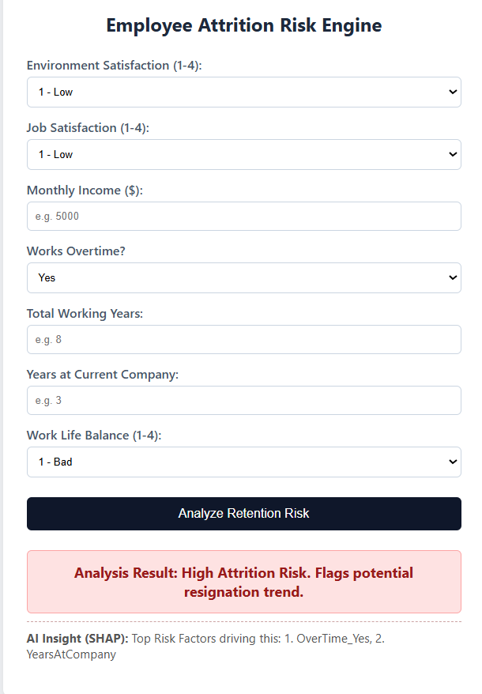

# Employee Attrition Risk Predictor with Explainable AI (SHAP)

A Flask-based web application that predicts employee retention risks using machine learning and provides transparent, human-readable insights using **SHAP (SHapley Additive exPlanations)**.

Instead of treating the model as a black box, this application explicitly calculates and showcases the top two workplace metrics causing an individual's specific attrition flag.

---

## 🚀 Features

- **Predictive Pipeline:** Classifies employee profiles into high attrition risks or stable profiles.
- **Explainable AI Engine:** Uses SHAP values with a custom deduplication parsing loop to display the **top two distinct factors** driving each prediction (e.g., preventing duplicate explanations from one-hot encoded variables such as Overtime).
- **Interactive Frontend:** Clean and responsive web interface built using HTML, CSS, and Jinja2 templates.

---
## 📱 Application Interface


---
## 🛠️ Installation & Setup

### 1. Clone the Repository

```bash
git clone https://github.com/YOUR_USERNAME/YOUR_REPOSITORY_NAME.git
cd YOUR_REPOSITORY_NAME
```

### 2. Create and Activate a Virtual Environment

**Windows**

```bash
python -m venv .venv
.venv\Scripts\activate
```

**macOS/Linux**

```bash
python -m venv .venv
source .venv/bin/activate
```

### 3. Install Dependencies

```bash
pip install -r requirements.txt
```

### 4. Run the Application

```bash
python app.py
```

### 5. Open in Browser

Visit:

```
http://127.0.0.1:5000/
```

---

## 🧠 Tech Stack

### Backend
- Python
- Flask

### Machine Learning & Explainable AI
- Scikit-learn
- SHAP
- NumPy
- Pandas

### Frontend
- HTML5
- CSS3
- Jinja2 Templates

---

## 📂 Project Structure

```text
Employee-Attrition-Predictor/
│
├── app.py
├── model.pkl
├── scaler.pkl
├── requirements.txt
├── README.md
│
├── templates/
│   └── index.html
│
├── static/
│   └── style.css
│
└── dataset/
    └── employee_data.csv
```

---

## 📈 How It Works

1. The user enters employee information through the web interface.
2. The trained machine learning model predicts whether the employee is at risk of attrition.
3. SHAP computes feature contributions for that specific prediction.
4. A custom parsing algorithm removes duplicate one-hot encoded features and selects the **top two most influential workplace factors**.
5. The application displays both the prediction and the explainable insights in a user-friendly format.

---

## ✨ Example Output

**Prediction:** High Attrition Risk

**Top Contributing Factors:**
- Frequent Overtime
- Low Monthly Income

---

## 📦 Requirements

Install all dependencies with:

```bash
pip install -r requirements.txt
```

---

## 🤝 Contributing

Contributions, suggestions, and improvements are welcome. Feel free to fork the repository and submit a pull request.

---

